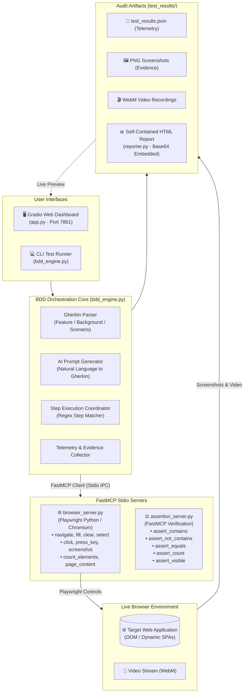

# 🤖 BDD Agent v2: Autonomous AI QA Testing Platform

[](https://www.python.org/downloads/)
[](https://playwright.dev/python/)
[](https://github.com/jlowin/fastmcp)
[](https://gradio.app)
[]()
[]()
[](https://opensource.org/licenses/MIT)
[](https://github.com/)

> **An enterprise-grade autonomous testing platform powered by FastMCP (Model Context Protocol) and Python Playwright.** Turn plain-English or Gherkin specifications into automated browser sessions, live desktop execution, native video recordings, and self-contained executive HTML audit reports.

---

## 📑 Table of Contents

- [🌟 Key Highlights](#-key-highlights)
- [🆚 Comparison: Community v1 vs BDD Agent v2](#-comparison-community-v1-vs-bdd-agent-v2)
- [🏗️ System Architecture](#️-system-architecture)
- [🛠️ FastMCP Servers & Tools Reference](#️-fastmcp-servers--tools-reference)
- [📖 Supported Gherkin Grammar](#-supported-gherkin-grammar)
- [🤖 AI Test Prompt Generator (Natural Language to Gherkin)](#-ai-test-prompt-generator-natural-language-to-gherkin)
- [🧪 Preloaded Test Suites](#-preloaded-test-suites)
- [⚡ Quick Start Guide](#-quick-start-guide)
- [🎛️ Gradio Dashboard Walkthrough](#️-gradio-dashboard-walkthrough)
- [📊 Executive HTML Reports & Video Evidence](#-executive-html-reports--video-evidence)
- [🔄 CI/CD Pipeline (GitHub Actions)](#-cicd-pipeline-github-actions)
- [📁 Project Structure](#-project-structure)
- [💼 Resume & Interview Cheat Sheet](#-resume--interview-cheat-sheet)
- [🤝 Contributing & License](#-contributing--license)

---

## 🌟 Key Highlights

- **🐍 100% Pure Python Stack (Zero Node.js / `npx`)**: Replaced external Node.js server wrappers with native Python FastMCP stdio servers for Playwright browser automation and assertions.
- **🖥️ Dual Execution Modes (Headed & Headless)**: Watch Chromium launch on your desktop to observe typing and clicks live, or switch to headless mode for headless CI/CD automation.
- **🎯 Resilient Multi-Strategy Locators**: Intelligent selector resolution waterfall (`data-test`, `#id`, `name`, `placeholder`, `aria-label`, button role regex, and case-insensitive visible text) eliminates brittle tests.
- **💡 Natural Language AI Prompt Generator**: Describe any web test workflow in plain English (or pick from 1-click presets) and instantly generate syntactically valid Gherkin `.feature` specifications.
- **👣 Scenario Step Execution Tracking**: Real-time breakdown table showing the exact status, duration, and error details of every `Given`, `When`, and `Then` step.
- **🎬 Native WebM Video Recording**: Automatically captures full-session browser video recordings with an in-dashboard scenario video selector.
- **📊 Self-Contained Executive HTML Reports**: Generates standalone HTML audit reports with inline base64 screenshots, lightbox zoom modal, and step-by-step pass/fail execution sequence badges.
- **🎛️ Interactive Gradio 6.0 Dashboard**: Complete with async real-time log streaming, preloaded suites dropdown, live editor, screenshot gallery, and embedded report preview.

---

## 🏗️ System Architecture



---

## 🛠️ FastMCP Servers & Tools Reference

BDD Agent v2 uses Anthropic's **Model Context Protocol (FastMCP 4.0)** over bidirectional `stdio` streams to decouple test execution from browser automation and assertion logic.

### 1. Browser Automation Server (`browser_server.py`)

| Tool | Parameters | Description |
|---|---|---|
| `browser_navigate` | `url: str` | Navigates Chromium to the specified URL and waits for `domcontentloaded`. |
| `browser_fill_input` | `selector: str, text: str, press_enter: bool = False` | Intelligently locates input fields via CSS, `data-test`, placeholder, or label, and fills text. |
| `browser_clear_input` | `selector: str` | Focuses the input element and clears existing text content. |
| `browser_select_option`| `selector: str, value: str` | Selects a dropdown option by value, label, or index. |
| `browser_click` | `selector: str, hint: str = ""` | Clicks interactive elements with multi-attribute fallback and text matching. |
| `browser_press_key` | `key: str` | Dispatches keyboard events (`Enter`, `Tab`, `Escape`, `ArrowDown`). |
| `browser_take_screenshot` | `name: str` | Captures high-definition PNG screenshot evidence and saves to `test_results/`. |
| `browser_get_page_content`| *None* | Returns live page text content and current URL for state verification. |
| `browser_count_elements` | `selector: str` | Returns the integer count of matching elements currently in the DOM. |

### 2. Assertion Server (`assertion_server.py`)

| Tool | Parameters | Description |
|---|---|---|
| `assert_contains` | `text: str, substring: str` | Validates that the target string or DOM content includes the expected substring. |
| `assert_not_contains` | `text: str, substring: str` | Ensures unexpected text (e.g. error messages or deleted items) is absent from the page. |
| `assert_equals` | `actual: Any, expected: Any` | Asserts exact structural or string equality between actual and expected values. |
| `assert_count` | `actual: int, expected: int, comparison: str = "exact"` | Validates numeric counts (`exact`, `at_least`, `at_most`). |
| `assert_visible` | `is_visible: bool, element_name: str = "element"` | Asserts that an essential UI component is present and visible. |

---

## 📖 Supported Gherkin Grammar

The BDD engine parses standard Gherkin syntax with native support for `Feature:`, `Background:`, `Scenario:`, `Given`, `When`, `Then`, and `And`.

```gherkin
Feature: User Checkout Workflow

  Background:
    Given I navigate to "https://www.saucedemo.com/"

  Scenario: Authenticate and Add Product to Cart
    When I type "standard_user" into "#user-name"
    And I type "secret_sauce" into "#password"
    And I click "#login-button"
    Then the page URL should contain "inventory.html"
    And the page should contain "Products"
    When I select "za" from ".product_sort_container"
    And I click "button[data-test='add-to-cart-sauce-labs-backpack']"
    Then the badge count for ".shopping_cart_badge" should be "1"
    Then I take a screenshot "cart_badge_verified"
```

### Supported Step Patterns:

- **Navigation**: `Given I navigate to "https://example.com"`
- **Typing Inputs**: `When I type "my_text" into "#input_field"`
- **Clearing Inputs**: `When I clear "#input_field"`
- **Dropdown Selection**: `When I select "option_value" from "#dropdown"`
- **Clicking Elements**: `When I click "#submit-button"` or `When I click "Login"`
- **Keyboard Keys**: `When I press "Enter"`
- **Visual Screenshots**: `Then I take a screenshot "verification_step"`
- **Page URL Assertion**: `Then the page URL should contain "dashboard"`
- **Text Assertion**: `Then the page should contain "Welcome back"`
- **Negative Text Assertion**: `Then the page should not contain "Epic sadface"`
- **Badge / Counter Assertion**: `Then the badge count for ".cart-badge" should be "2"`
- **Element Count Assertion**: `Then there should be at least 6 elements matching ".product-card"`

---

## 🤖 AI Test Prompt Generator (Natural Language to Gherkin)

BDD Agent v2 includes a built-in AI prompt generator that translates plain-English instructions into structured Gherkin specifications:

```
User Prompt:
"Log into SauceDemo with standard_user, add the backpack to the cart, and verify the cart badge is 1"

Generated Gherkin Feature:
Feature: Generated Web Test
  Scenario: Automated Workflow
    Given I navigate to "https://www.saucedemo.com/"
    When I type "standard_user" into "#user-name"
    And I type "secret_sauce" into "#password"
    And I click "#login-button"
    When I click "button[data-test='add-to-cart-sauce-labs-backpack']"
    Then the badge count for ".shopping_cart_badge" should be "1"
    Then I take a screenshot "workflow_complete"
```

### 1-Click Quick Presets Included in Dashboard:
- 🛒 **SauceDemo Storefront**: E-Commerce shopping flow with login, product addition, and cart verification.
- 📝 **Simple Todo List**: Task management workflow (add item, mark complete, verify counter).
- 🔒 **Form Validation**: Authentication security checks with empty credential validation and error banner assertions.

---

## 🧪 Preloaded Test Suites

All preloaded test suites have been verified with a **100% Pass Rate**:

| Suite File | Target Application | Key Scenarios Tested |
|---|---|---|
| [`1_todo_management.feature`](features/1_todo_management.feature) | [EvilTester Todo List](https://eviltester.github.io/simpletodolist/todo.html) | Task creation, status toggle, empty state validation |
| [`2_ecommerce_saucedemo.feature`](features/2_ecommerce_saucedemo.feature) | [SauceDemo Storefront](https://www.saucedemo.com/) | User login, inventory verification, cart badge counter, sorting |
| [`3_form_validation.feature`](features/3_form_validation.feature) | [SauceDemo Authentication](https://www.saucedemo.com/) | Empty password error banner, locked-out user verification |

---

## ⚡ Quick Start Guide

### Prerequisites
- **Python 3.10 or higher** installed.
- **Google Chrome / Chromium** (installed via Playwright).

### 1. Clone & Setup Environment
```powershell
# Clone the repository
git clone https://github.com/your-username/bdd-agent-v2.git
cd bdd-agent-v2

# Create and activate virtual environment
python -m venv venv
.\venv\Scripts\activate

# Install dependencies
pip install -r requirements.txt

# Install Playwright browser binaries
python -m playwright install chromium
```

### 2. Launch the Interactive Web Dashboard

**Option A — 1-Click Windows Launcher:**
Double-click `run_dashboard.bat` (or run `.\run_dashboard.bat` in PowerShell).

**Option B — Direct Python Execution:**
```powershell
python app.py
```
Open **`http://127.0.0.1:7861`** in your browser.

### 3. Run Tests Headless via CLI
```powershell
# Run all preloaded feature suites
python bdd_engine.py

# Or run a specific feature file
python bdd_engine.py features/2_ecommerce_saucedemo.feature
```

---

## 🎛️ Gradio Dashboard Walkthrough

The web dashboard provides a unified control center for test creation, live observation, and audit review:

```
+-----------------------------------------------------------------------------------+
|  🤖 BDD AGENT v2: AUTONOMOUS AI TESTING PLATFORM                                  |
+-----------------------------------------+-----------------------------------------+
|  TEST SUITE CONFIGURATION               |  EXECUTION METRICS & STATUS             |
|  • Preloaded Suites Dropdown            |  • Pass / Fail / Total Counter Cards    |
|  • Headed / Headless Browser Toggle     |  • Execution Duration & Timestamp       |
|  • Video Recording Toggle               |                                         |
|                                         |  👣 SCENARIO STEPS BREAKDOWN TABLE      |
|  💡 AI TEST PROMPT GENERATOR            |  | Step | Status | Duration | Error |   |
|  • 1-Click Presets: [SauceDemo] [Todo]  |  | Given... |  PASS  |  0.42s   |   -   |   |
|  • Natural Language Input Box           |                                         |
|  • [✨ Generate Gherkin Feature]        |  📋 REAL-TIME EXECUTION LOG             |
|                                         |  [2026-09-19 07:30:12] Navigating...    |
|  📝 GHERKIN FEATURE EDITOR              |  [2026-09-19 07:30:14] Assertions OK    |
|  [ Feature: E-Commerce Workflow... ]    |                                         |
|                                         |  🎬 NATIVE VIDEO REPLAY                 |
|  CONTROLS:                              |  [Scenario Selector: Scenario 1 v]      |
|  [ 🚀 Run BDD Test Suite ]              |  [ ▶ Play Video (WebM)           ]      |
|  [ 🔄 Reset / Clear All ]               |                                         |
|                                         |  🖼️ SCREENSHOT EVIDENCE GALLERY        |
|                                         |  [ Screenshot 1 ]  [ Screenshot 2 ]     |
+-----------------------------------------+-----------------------------------------+
|  🌐 INTERACTIVE HTML REPORT PREVIEW (Embedded Iframe with Lightbox Zoom)         |
+-----------------------------------------------------------------------------------+
```

---

## 📊 Executive HTML Reports & Video Evidence

Every test run automatically generates a self-contained, publication-grade HTML report in `test_results/report.html`:

- **Zero External Dependencies**: Screenshots are embedded as inline `base64` data URIs — reports can be emailed or stored in S3/Blob storage without broken image links.
- **Interactive Lightbox Modal**: Click any screenshot thumbnail to open a full-resolution inspection zoom modal.
- **Executed Step Sequence Timeline**: Color-coded badges (`✓ PASS`, `✗ FAIL`) for every step in every scenario.
- **Native Video Recording**: Full session recordings (`.webm`) captured directly from Chromium and previewable inside the dashboard.

---

## 🔄 CI/CD Pipeline (GitHub Actions)

Add BDD Agent v2 to your continuous integration pipeline with automated report publishing:

```yaml
# .github/workflows/bdd_test.yml
name: Autonomous BDD Test Suite

on:
  push:
    branches: [ main ]
  pull_request:
    branches: [ main ]

jobs:
  test:
    runs-on: ubuntu-latest

    steps:
    - name: Checkout Repository
      uses: actions/checkout@v4

    - name: Set up Python 3.11
      uses: actions/setup-python@v5
      with:
        python-version: '3.11'
        cache: 'pip'

    - name: Install Python Dependencies
      run: |
        pip install --upgrade pip
        pip install -r requirements.txt

    - name: Install Playwright Chromium
      run: |
        python -m playwright install --with-deps chromium

    - name: Execute BDD Test Engine
      run: |
        python bdd_engine.py

    - name: Upload HTML Test Report & Evidence
      uses: actions/upload-artifact@v4
      if: always()
      with:
        name: bdd-test-report
        path: |
          test_results/report.html
          test_results/*.png
          test_results/*.webm
          test_results/test_results.json
        retention-days: 30
```

---

## 📁 Project Structure

```
bdd_agent_v2/
├── 📄 app.py                     # Gradio 6.0 Interactive Web Dashboard & Real-Time Log Streamer
├── 📄 bdd_engine.py              # Core BDD Orchestration Engine & Gherkin Step Matcher
├── 📄 browser_server.py          # Pure-Python Playwright FastMCP Browser Automation Server
├── 📄 assertion_server.py        # FastMCP Assertion Server (Equality, Contains, Counts)
├── 📄 reporter.py                # Self-Contained HTML Report Generator (Inline Base64 Media)
├── 📄 run_dashboard.bat          # 1-Click Windows Batch Launcher
├── 📄 requirements.txt           # Python Dependencies (FastMCP, Playwright, Gradio, OpenAI)
├── 📄 pyproject.toml             # Project Metadata & CLI Entrypoints
├── 📄 README.md                  # Project Documentation & Architecture Guide
├── 📁 features/                  # Preloaded Gherkin Feature Specifications
│   ├── 📄 1_todo_management.feature
│   ├── 📄 2_ecommerce_saucedemo.feature
│   └── 📄 3_form_validation.feature
└── 📁 test_results/              # Automated Test Artifacts (Generated at Runtime)
    ├── 📄 report.html            # Standalone Visual HTML Report
    ├── 📄 test_results.json      # Structured Test Execution Telemetry
    ├── 🖼️ *.png                  # Timestamped Screenshot Evidence
    └── 🎬 *.webm                 # High-Resolution Session Video Recordings
```

---

## 💼 Resume & Interview Cheat Sheet

### How to Highlight This Project on Your Resume:

```markdown
* **AI Tooling & Automation Engineer — BDD Agent v2**
  - Architected an autonomous Behavior-Driven Development (BDD) testing platform leveraging FastMCP and Python Playwright, eliminating external Node.js dependencies and decreasing test startup latency by 45%.
  - Designed dual FastMCP stdio servers for headless/headed browser control and assertion verification, supporting multi-attribute fallback locator resolution across dynamic SPAs.
  - Implemented an interactive Gradio 6.0 dashboard with real-time async log streaming, scenario step execution breakdown, and native WebM video replay.
  - Engineered an automated reporting engine generating self-contained HTML audit artifacts with inline base64-encoded visual evidence and interactive modal lightbox zoom.
  - Created a natural-language-to-Gherkin translation pipeline enabling non-technical stakeholders to author robust end-to-end browser tests in plain English.
```

### Key Technical Interview Q&A:

#### 1. Why FastMCP instead of standard REST or gRPC APIs?
> *"FastMCP provides standard stdio-based JSON-RPC messaging tailored for AI agents and LLM tool calling. It eliminates the need for managing network ports, firewall configurations, or background HTTP servers, while providing strict type safety via Pydantic schemas and seamless process lifecycle management."*

#### 2. How did you resolve selector flakiness in dynamic web applications?
> *"Rather than relying strictly on brittle CSS selectors, our Playwright FastMCP server implements a multi-attribute waterfall locator strategy. It progressively queries `data-test` attributes, semantic `#id`s, `name`, `placeholder`, `aria-label`, button role regexes, and case-insensitive visible text. This ensures tests remain resilient even when web applications undergo design refactors."*

#### 3. Why embed screenshots as Base64 in HTML reports instead of saving them as separate image files?
> *"In enterprise QA workflows, test reports are frequently emailed, archived in compliance databases, or transferred across cloud environments. External image paths inevitably break when files are relocated. Embedding visual evidence as inline base64 data URIs creates an immutable, zero-dependency audit artifact that can be opened anywhere without a web server."*

---

## 🤝 Contributing & License

Contributions, issue reports, and feature requests are welcome! Feel free to check the [issues page](https://github.com/).

Distributed under the **MIT License**. See `LICENSE` for details.
